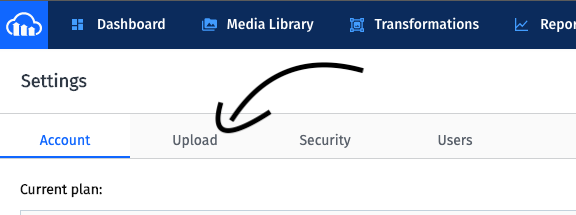
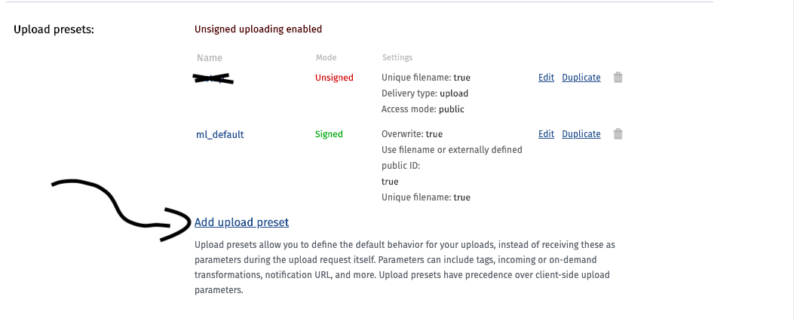

# Como fazer upload de imagens para a nuvem usando a API do cloudinary com React Native

Estou a escrever este pequeno artigo pois recentemente encontrei certa dificuldade para conseguir realizar esta tarefa em um projeto.

Vamos lá:

- Faça cadastro no [Cloudinary](https://cloudinary.com/users/register/free)
- Adicione ao seu projeto o [react-native-image-crop-picker](https://github.com/ivpusic/react-native-image-crop-picker) (ele permite que o usuário consiga adicionar fotos que estão em sua galeria)
- Adicione ao seu projeto o [react-native-image-resizer](https://github.com/bamlab/react-native-image-resizer) (como o nome sugere, permite fazer uma modificação no tamanho da imagem que será posteriormente enviada para a nuvem, além de permitir uma compressão, diminuindo o tamanho da imagem final)
- Adicione ao seu projeto o [react-native-image-base64](https://www.npmjs.com/package/react-native-image-base64) (vai permitir a codificação)

Bom, vou começar com o código inteiro e depois o explicarei por partes, certo?

```
import React from 'react'
import { View, TouchableOpacity, Text } from 'react-native'

import ImagePicker from 'react-native-image-crop-picker'
import ImageResizer from 'react-native-image-resizer'
import ImgToBase64 from 'react-native-image-base64'

export default function App () {

    function resizeImages (images) {

        ImageResizer.createResizedImage(images[0].path, 80, 80, 'JPEG', 80)
        .then(res => {

            ImgToBase64.getBase64String(res.path)
            .then(base64String => uploadImageToCloud(base64String))
            .catch(err => console.log(err));

            })
            .catch(err => {

                console.log(err)

            });

    }

    function uploadImageToCloud (path) {

        let newImage = `data:jpeg;base64,${path}`

        const data = new FormData()
        data.append('file',newImage)
        data.append('upload_preset','SEU_UPLOAD_PRESET')
        data.append("cloud_name","SEU_NOME_DE_USUARIO_NO_CLOUDINARY")

        fetch("https://api.cloudinary.com/v1_1/SEU_NOME_DE_USUARIO_NO_CLOUDINARY/upload", {

            method: 'POST',
            body: data

        })
        .then( async res=> await res.json() )
        .then(data=>{
            console.log(data)
        })

    }
    
    return (
        
        <TouchableOpacity
            onPress = {()=> ImageWorkPicker.openPicker({
                height: 80,
                width:80,
                includeBase64: true,
                multiple: true
            }).then(images => {
                //   console.log(images)
                resizeImages(images)
            })}
        >

            <Text>Escolha as fotos</Text>

        </TouchableOpacity>
    
    )

}
```

## Configurações Cloudinary

- Após fazer um cadastro no Cloudinary, clique nas configurações (canto superior direito):


- Entre na seção "Upload":




- Vá para a seção "Upload presets" e clique para adicionar um novo:



- Troque a opção "Signing Mode" para "unsigned" e salve:


## Código

### Neste ponto você já deve ter todas as bibliotecas em seu projeto!

- Será renderizado um "botão" para que o usuário possa selecionar as imagens que deseja enviar:
```
return (
        
        <TouchableOpacity
            onPress = {()=> ImageWorkPicker.openPicker({
                height: 80,
                width:80,
                includeBase64: true,
                multiple: true
            }).then(images => {
                resizeImages(images)
            })}
        >

            <Text>Escolha as fotos</Text>

        </TouchableOpacity>
    
)
    
```


- Ao clicar neste botão e escolher as imagens estas serão tratadas para que sejam enviadas para a nuvem. Faremos uma compressão e diminuiremos seu tamanho usando a biblioteca "react-native-image-resizer": Uma observação é que para fins didáticos eu só estou usando a primeira imagem escolhida (images[0])

```

function resizeImages (images) {

    ImageResizer.createResizedImage(images[0].path, 80, 80, 'JPEG', 80)
    .then(res => {

        ImgToBase64.getBase64String(res.path)
        .then(base64String => uploadImageToCloud(base64String))
        .catch(err => console.log(err));

    })
    .catch(err => {

        console.log(err)

    });

}
    
```

Recebemos como parâmetro o caminho da imagem a ser renderizada, a altura, a largura, o formato de saida e a qualidade final que desejamos (neste caso, 80% da original).


- Quando essa compressão acabar, faremos a conversão para base64 (requisito da API do Cloudinary):

```

ImgToBase64.getBase64String(res.path)
    .then(base64String => uploadImageToCloud(base64String))
    .catch(err => console.log(err));

```


- Enviaremos então esta informação para a função que finalmente fará o upload das imagens:

```
function uploadImageToCloud (path) {

    let newImage = `data:jpeg;base64,${path}`

    const data = new FormData()
    data.append('file',newImage)
    data.append('upload_preset','SEU_UPLOAD_PRESET')
    data.append("cloud_name","SEU_NOME_DE_USUARIO_NO_CLOUDINARY")

    fetch("https://api.cloudinary.com/v1_1/SEU_NOME_DE_USUARIO_NO_CLOUDINARY/upload", {

        method: 'POST',
        body: data

    })
    .then( async res=> await res.json() )
    .then(data=>{
        console.log(data)
    })

}

```


- Ela recebe o caminho do arquivo, faz as configurações necessárias como definir o upload_preset e o cloud name que você configurou nos passos anteriores . Daí faz o post na API e você terá um retorno parecido com isto:

```

access_mode: "public"
asset_id: "f53542dbd295d8b02805bae18d7e2a99"
bytes: 2058
created_at: "2020-08-22T22:57:53Z"
etag: "6e8e2b208ca5af3300db400e70204b2b"
format: "jpg"
height: 53
placeholder: false
public_id: "vcayx3q68ihhtjpogrof"
resource_type: "image"
secure_url: "https://res.cloudinary.com/pdsgij/image/upload/v1598137073/vcayx3q68ihhtjpogrof.jpg"
signature: "0e8f3f984ad445870b2cb11e822624eb7fd974ec"
tags: []
type: "upload"
url: "http://res.cloudinary.com/pdsgij/image/upload/v1598137073/vcayx3q68ihhtjpogrof.jpg"
version: 1598137073
version_id: "f116552d99814e5d08ff11eacff1fa4a"
width: 80

```

Agora é só salvar o url no seu banco de dados para acessar posteriormente!


Espero que isto te seja muito útil :)
