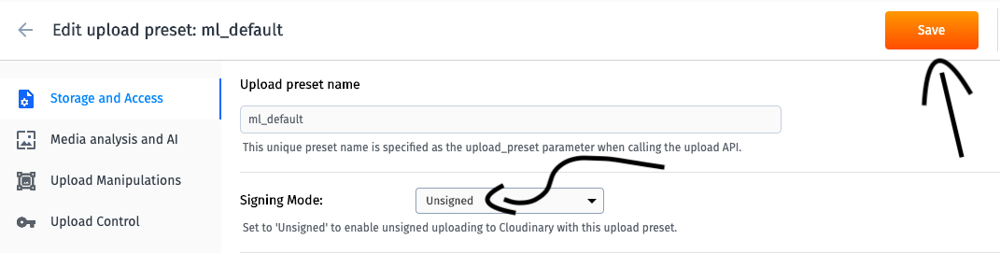

Estou a escrever este pequeno artigo pois recentemente encontrei certa dificuldade para conseguir realizar esta tarefa. ...............completar.............

- Faça cadastro no [Cloudinary](https://cloudinary.com/users/register/free)
- Adicionar o [react-native-image-crop-picker](https://github.com/ivpusic/react-native-image-crop-picker) (ele permite que o usuário consiga adicinar fotos que estão em sua galeria)
- Adicionar o [react-native-image-resizer](https://github.com/bamlab/react-native-image-resizer) (como o nome sugere, permite fazer uma modificação no tamanha da imagem que será posteriormente enviada para a nuvem, além de permitir uma compressão, diminuindo o tamanho da imagem final)
- Adicionar o [react-native-image-base64](https://www.npmjs.com/package/react-native-image-base64) (vai permitir a codificação)

Bom, vou começar com o código inteiro e depois o explicarei por partes, fechô?

```
import React from 'react'
import { View, TouchableOpacity, Text } from 'react-native'

import ImagePicker from 'react-native-image-crop-picker'
import ImageResizer from 'react-native-image-resizer'
import ImgToBase64 from 'react-native-image-base64'

export default function App () {

    function resizeImages (images) {

        ImageResizer.createResizedImage(images[0].path, 80, 80, 'JPEG', 50)
        .then(res => {

            ImgToBase64.getBase64String(res.path)
            .then(base64String => uploadImageToCloud(base64String))
            .catch(err => console.log(err));

            })
            .catch(err => {

                console.log(err)

            });

    }

    function uploadImageToCloud (path) {

        let newImage = `data:jpeg;base64,${path}`

        const data = new FormData()
        data.append('file',newImage)
        data.append('upload_preset','SEU_UPLOAD_PRESET')
        data.append("cloud_name","SEU_NOME_DE_USUARIO_NO_CLOUDINARY")

        fetch("https://api.cloudinary.com/v1_1/SEU_NOME_DE_USUARIO_NO_CLOUDINARY/upload", {

            method: 'POST',
            body: data

        })
        // .then( async res => { dataResult = await res.json() } )
        .then( async res=> await res.json() )
        .then(data=>{
            console.log(data)
        })

    }
    
    return (
        
        <TouchableOpacity
            onPress = {()=> ImageWorkPicker.openPicker({
                height: 80,
                width:80,
                includeBase64: true,
                multiple: true
            }).then(images => {
                //   console.log(images)
                resizeImages(images)
            })}
        >

            <Text>Escolha as fotos</Text>

        </TouchableOpacity>
    
    )

}
```

## Configurações Cloudinary

- Após fazer um cadastro no Cloudinary, clique nas configurações (canto superior direito):


- Entre na seção "Upload":


- Vá para a seção "Upload presets" e clique para adicionar um novo:


- Troque a opção "Signing Mode" para "unsigned" e salve:

